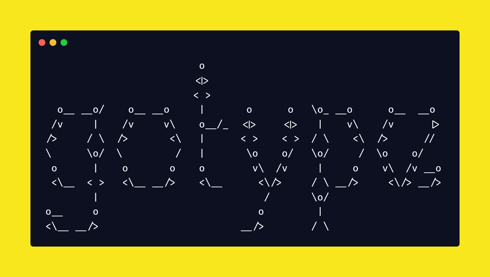
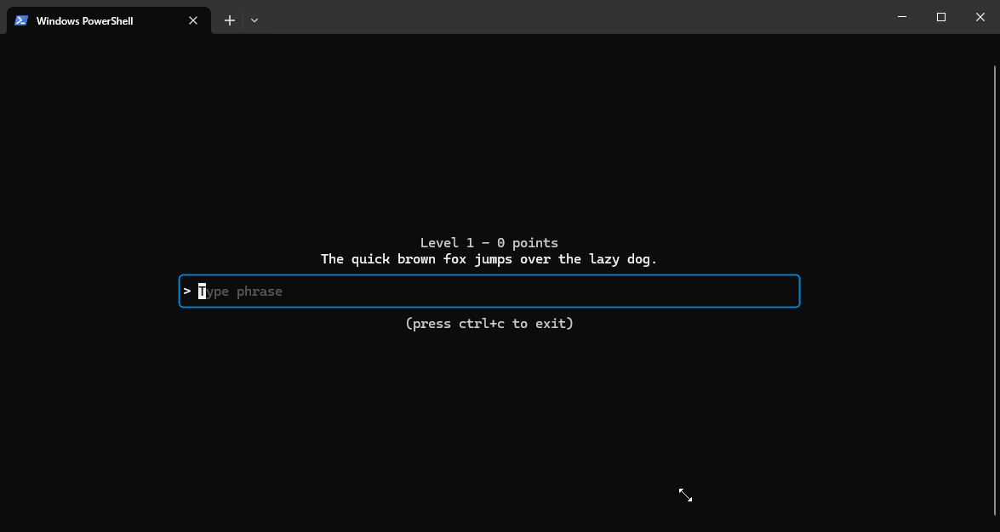

# GOTYPE - A terminal based typing game.

This is a really small project just made so I could learn **GO**, it's not complete in any way but was a cool one day project.

It was made using some really cool go packages for **TUI** such as: [lipgloss](https://github.com/charmbracelet/lipgloss) and [bubbletea](https://github.com/charmbracelet/bubbletea)



## Install

To install the game, open the releases tab located at the side of this github page and download the **_gotype.zip_** file and extract it in the desired location

## Usage

To play the game, open your favorite terminal and navigate to the location you've extracted the **zip** file.

On **windows**, hit <kbd>WIN + R</kbd> and insert `cmd`, a terminal should popup, then you type:

```bash
cd <path_to_install>
```

Then, execute the game by typing:

```bash
gotype.exe
```

## Contribuitions

This is not meant to be a complete project in any way, but if you want to contribute to it, you are more than welcome to do so.

## License

[MIT](https://choosealicense.com/licenses/mit/)
